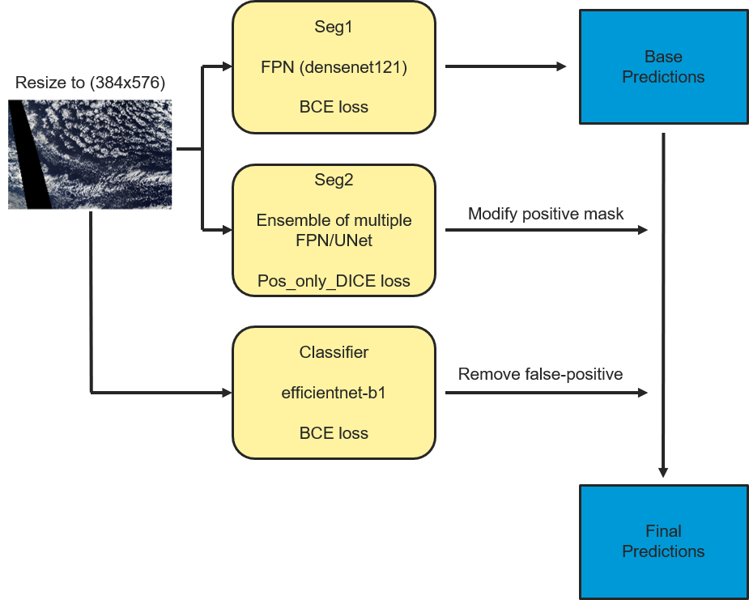

#Kaggle Understanding Clouds from Satellite Images Challenge.

n summary the pipeline looks like:

seg1: a multi-label segmentation model trained with BCE loss
seg2: a multi-label segmentation model trained with pos-only soft DICE loss
cls: a multi-label classifier trained with BCE loss.
The final submission is achieved by the following steps:

Get predictions using seg1
Replacing the non-empty masks from seg1 by predictions from seg2
Removing more empty masks using cls
Both pixel-level (segmentation) and image-level (classifier) thresholds are 0.5.

Baseline results for the 2-stage segmentation
Model summary:

Network: Resnet34-FPN
Image size: 384x576
Batch size: 16
Optimizer: Adam
Scheduler: reduceLR for seg1, warmRestart for seg2.
Augmentations: H/V flip, ShiftScalerRotate and GridDistortion
TTA: raw, Horizontal Flip, Vertical Flip

Results:

1-fold: 0.664
5-fold + TTA3: 0.669
5-fold + TTA3 + classifier: 0.670.

TTA1 means only raw images; TTA3 means raw + H/V flip.

The rest of my work is just trying different backbones to find the best one. My final models are:

seg1: densenet121-FPN, TTA1
seg2: b7-FPN, TTA3
cls: b1, TTA1

Results:

1-fold LB: 0.673
5-fold LB: 0.6788

Ensemble
I ensembled multiple seg2 models using major vote. By including 4 models (b5-Unet, InceptionResnetV2-FPN, b7-FPN and b7-Unet), I achieved 0.6792 on LB.

Pseudo Labeling
I selected the pseudo labels based a LB 0.6790 submission with the following rules:

Empty channels with classifier prediction < 0.3
Non-empty channels with classifier prediction > 0.7
An image is selected when all the 4 channels satisfy one of the conditions. 835 images are selected. I retrained the b7-FPN and b1-classifier including the pseudo labeling samples, and the final models are:

seg1: densenet121-FPN, TTA1
seg2: b5-Unet + InceptionResnetV2-FPN + b7-Unet + b7-FPN + b7-FPN-PL, TTA3
cls: b1-PL, TTA3

PL means the model is retrained with pseudo labels

This model achieves 0.6794 LB.

On the last day, I decide to optimize the classifier threshold channel wise to achieve the best local CV, which gives me 0.6805 LB.
## Solution Overview


## Archive Contents
```
.
./input                          : images and .csv files for mask labels
./output                         : trained models, logs and predictions
./kaggle-cloud-organization      : code
```

## Software:
* Python 3.7.3
* CUDA 10.1
* cuddn 7602
* nvidia drivers v418.67

python packages are detailed separately in `requirements.txt`

## Data setup:
Assumes the [Kaggle API](https://github.com/Kaggle/kaggle-api) is installed, below are the shell commands used in each step, as run from the top level directory.
```
$ mkdir -p input
$ cd input
$ kaggle competitions download -c understanding_cloud_organization
$ unzip train_images_zip -d ./images
$ unzip test_images_zip -d ./images
```
Please make sure the unzipped train and test images are in the same folder named "images".

## Data proprecessing
This will convert the raw images to 384x576 and build .csv file for 5-fold info. The 5-fold info .csv is already included in ./kaggle-cloud-organization/files/
```
$ cd kaggle-cloud-organization
$ python preprocessing_images.py
$ python make_folds.py
```

## Model build
There are 4 steps to reproduce the model from scratch. Shell command to run each step is below.
1. Train seg1 model and predict.
```
$ bash ./kaggle-cloud-organization/run_seg1.sh
```
2. Train seg2 models and predict.
```
$ bash ./kaggle-cloud-organization/run_seg2.sh
```
3. Train cls model and predict.
```
$ bash ./kaggle-cloud-organization/run_cls.sh
```
4. Ensemble the final predictions
```
$ cd output
$ mkdir -p b5-Unet-inception-FPN-b7-Unet-b7-FPN-b7-FPNPL
$ mkdir -p ensemble
$ cd ..
$ python ./kaggle-cloud-organization/mask-ensemble-5fold.py
$ python ./kaggle-cloud-organization/2-stage-ensemble-5fold.py
```
The final prediction file can be found as ./output/ensemble/test_5fold_tta3_cls.csv
